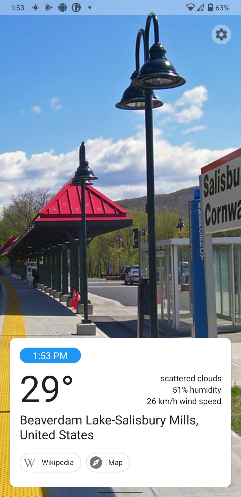

# Elsewhere
*The weather app that tells you the weather where you aren't*

Every day, Elsewhere gives you the weather in another random location in the world.

## Why?
Well, you already know the weather where you are, don't you? Maybe you don't know the exact number, but I bet you could estimate it based on the temperature sensors in your body. What you *don't* know, however, is the weather in [Água Doce, Brazil](https://en.wikipedia.org/wiki/%C3%81gua_Doce). (Unless you live there, that is.)

## Download
APK build coming soon...

## Build
Get an OpenWeatherMap API key and create a file called `keys.properties` in the root of this repo, then format it like this:

    OWM_KEY="your OWM API key here"

You can then build it normally.

**Tip:** if you don't want to use Android Studio, make sure ADB is in your path and launch the app using `dbg.ps1`. It will build the app, install it on your device, run it, and launch logcat filtered to messages from this app.

## About
Created by David Teresi.  
Weather data is sourced from [OpenWeatherMap](https://openweathermap.org). Place images are collected using [Wikipedia](https://wikipedia.org/).

Licensed under the Mozilla Public License. For more information see [LICENSE.txt](LICENSE.txt).
