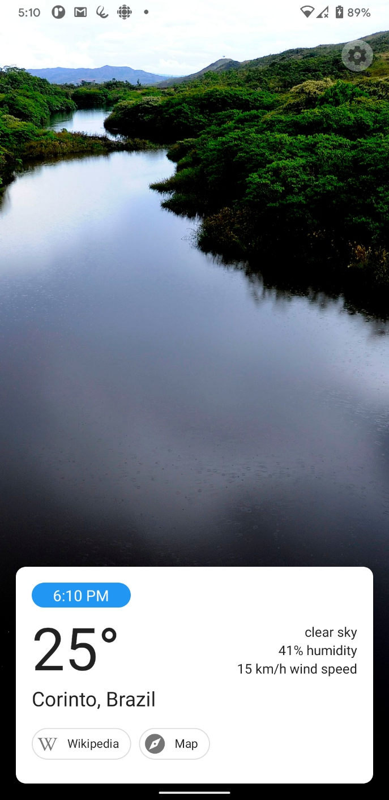
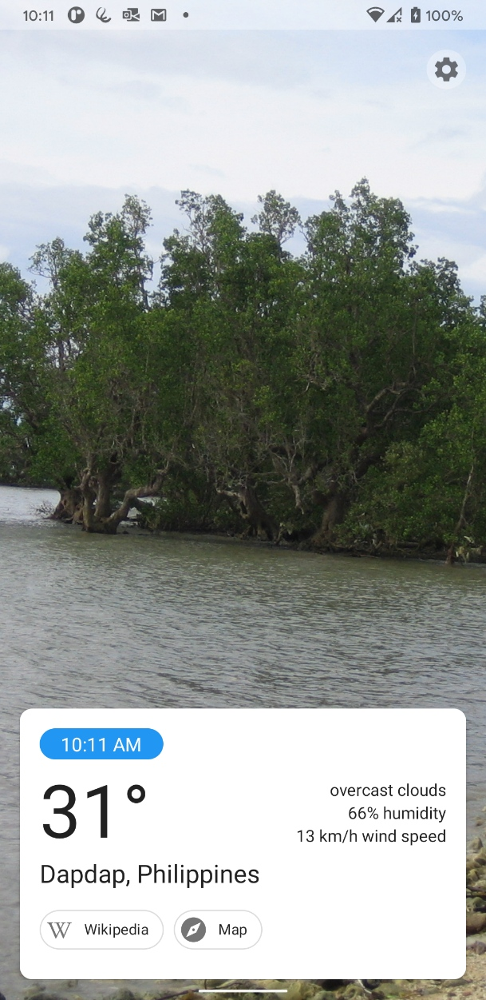

# Elsewhere
*The weather app that tells you the weather where you aren't*

Every day, Elsewhere gives you the weather in another random location in the world.

## Why?
Well, you already know the weather where you are, don't you? What you *don't* know, however (unless you live there) is the weather in Concordia, Argentina or Yingshang Chengguanzhen, China.

Through using Elsewhere, you may discover a new place you've never heard of before. Actually, scratch that. I can *guarantee* you will. Almost every day, in fact. The world is huge, and there just isn't enough time to visit every corner of it -- but maybe there's enough time to become aware of more places.

## Download
Elsewhere targets Android 11.0 and supports Android 5.0 (Lollipop) and newer.

### Google Play Store
coming soon!

### F-Droid
Make sure you have the [IzzyOnDroid F-Droid repo](https://apt.izzysoft.de/fdroid/index/) added:
- Go to F-Droid Settings -> Repositories
- Tap the plus button in the top right 
- Add this URL under "Repository address": `https://apt.izzysoft.de/fdroid/repo`

Then, download Elsewhere through F-Droid: 
https://f-droid.org/packages/me.davidteresi.elsewhere

### APK download
Alternatively, [click here](https://github.com/dkter/elsewhere/releases/download/v1.0/Elsewhere.apk) to download an APK you can install on your phone.

## Build
Get an OpenWeatherMap API key and create a file called `keys.properties` in the root of this repo, then format it like this:

    OWM_KEY="your OWM API key here"

You can then build it normally.

**Tip:** if you don't want to use Android Studio, make sure ADB is in your path and launch the app using `dbg.ps1`. It will build the app, install it on your device, run it, and launch logcat filtered to messages from this app.

## About
Created by [David Teresi](https://davidteresi.me).  
Weather data is sourced from [OpenWeatherMap](https://openweathermap.org). Place images are from [Wikimedia Commons](https://commons.wikimedia.org) and collected using [Wikidata](https://wikidata.org/).

Licensed under the Mozilla Public License. For more information see [LICENSE.txt](LICENSE.txt).
